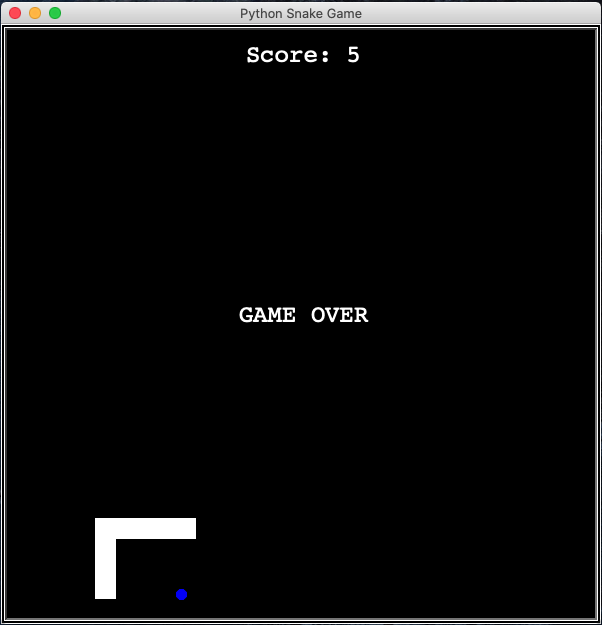
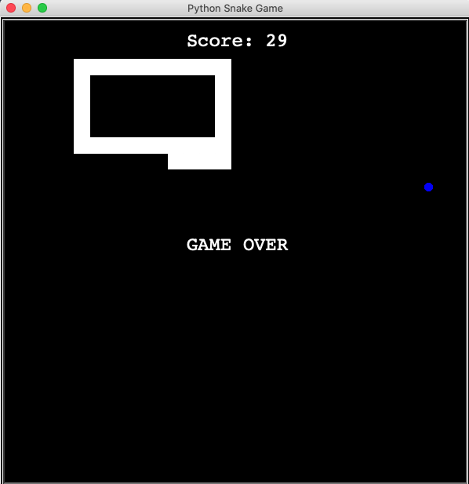

## 100 Day Challenge: Day 21 - Build the Snake Game
##### This practice is for getting familiar with class inheritance in Python.
- The snake can gain its length by eating the food.
- Game ends when the snake collides with the wall or its own tail.

